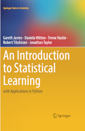

# Beginner track for machine learning

| MML for math (2020)            | ISLP for classic ML (2023)      | DLS for deep learning (2024)   |
| ------------------------------ | ------------------------------- | ------------------------------ |
|  |  |  |

Two free textbooks for math and classic machine learning (ML)
and a video course on deep learning (DL) make a solid entry track for beginners:

- [Mathematics for Machine Learning (MML)][mml] by Marc Peter Deisenroth, A. Aldo Faisal and Cheng Soon Ong;
- [Introduction to Statistical Learning with Python (ISLP)](https://www.statlearning.com/) by Gareth James, Daniela Witten, Trevor Hastie and Rob Tibshirani;
- [Deep Learning Specialization][dls] by Andrew Ng.

Links to other textbooks and supplementary materials are also provided below.

## Roadmap

```
Math   ML       DL                  Subfields and data types
=====  =======  =================   ============================

         +------------------------> Tabular data and time series
         |
MML  -> ISLP  -> deeplearning.ai -> Text and speech (NLP)
(free)  (free)   Deep Learning      Transformers (the T in ChatGPT)
         |       Specialisation     Computer vision (CV)
         |       + any of           Reinforcement learning (RL)
         |       3 free textbooks
         |
        Practical manuals:
        - scipy lectures (free)
        - Muller (paid), Geron (paid) or Burkov (free preview)

Python packages

Math:     ML:           DL:
- numpy   scikit-learn  - torch
- scipy                 - tf
                        - keras
```

## Prerequisites

You will need a working knowledge of Python and ability to operate with mathematical concepts
and notation from linear algebra and calculus.

## Core path

1. Check you math knowledge with [Mathematics for Machine Learning (MML)][mml] Part 1.
2. Read chapter 8 "When Models Meet Data" in [MML][mml] for introduction to machine learning.
3. Proceed to [Introduction to Statistical Learning with Python (ISLP)](https://www.statlearning.com/) textbook.
4. Read from `scikit-learn` documentation about [neural network models][nn].
5. Start Andrew Ng [Deep Learning Specialization][dls].

[dls]: https://www.deeplearning.ai/courses/deep-learning-specialization/
[mml]: https://mml-book.github.io/
[nn]: https://scikit-learn.org/stable/modules/neural_networks_supervised.html#neural-network-models-supervised

## Reference texts

There are more dense textbooks than ISLP or Andrew Ng course, you can use them as references.

For classic machine learning they are [Bishop (2006)](https://www.microsoft.com/en-us/research/uploads/prod/2006/01/Bishop-Pattern-Recognition-and-Machine-Learning-2006.pdf)
and [Murphy (2022)](https://probml.github.io/pml-book/book1.html).

For deep learning there are several open textbooks:

- [Ian Goodfellow, Yoshua Bengio and Aaron Courville (2016). Deep Learning Book (DLB)](https://www.deeplearningbook.org/)
- [Aston Zhang, Zack Lipton, Mu Li and Alex Smola (2021). Dive into Deep Learning (d2l).](https://d2l.ai/)[^1]
- [Simon Prince (2023). Understanding Deep Learning (UDL).](https://udlbook.github.io/udlbook/)

DLB (2016) is a reference text that enjoys [a continious stream of citations](https://scholar.google.ca/citations?view_op=view_citation&hl=en&user=iYN86KEAAAAJ&citation_for_view=iYN86KEAAAAJ:ZeXyd9-uunAC), while d2l and UDL are newer and keep updating their code and content.

[^1]: This open-source book represents our attempt to make deep learning approachable, teaching readers the concepts, the context, and the code. The entire book is drafted in Jupyter notebooks, seamlessly integrating exposition figures, math, and interactive examples with self-contained code. Our goal is to offer a resource that could (i) be freely available for everyone; (ii) offer sufficient technical depth to provide a starting point on the path to actually becoming an applied machine learning scientist; (iii) include runnable code, showing readers how to solve problems in practice; (iv) allow for rapid updates, both by us and also by the community at large; (v) be complemented by a forum for interactive discussion of technical details and to answer questions. \[[arxiv abstract](https://arxiv.org/abs/2106.11342)\]

## What else?

You can supplement the core path above with the following:

- introductory courses on probability
  (like [P4D](https://probability4datascience.com/)
  or [Seeing Theory](https://seeing-theory.brown.edu/basic-probability/index.html))
  and [statistics](https://jverzani.github.io/UsingJ/index.html);

- [scipy lectures](https://lectures.scientific-python.org/) is an
  underappreciated resource by the authors on foundational `scikit-learn`
  package themselves;

- [Python Data Science Handbook](https://jakevdp.github.io/PythonDataScienceHandbook/)
  including [a chapter on machine learning](https://jakevdp.github.io/PythonDataScienceHandbook/#5.-Machine-Learning)
  and the [DSML](https://people.smp.uq.edu.au/DirkKroese/DSML/) textbook (popular in Asia);

- practical books that combine machine learning concepts and programming practice
  -- either of
  [Müller](https://amueller.github.io/#book) (paid edition),
  [Géron](https://www.oreilly.com/library/view/hands-on-machine-learning/9781098125967/) (paid edition) or
  [Burkov](https://themlbook.com/) (free preview);

- code collections like [ML-From-Scratch](https://github.com/eriklindernoren/ML-From-Scratch)
  or [Kaggle competitions](https://www.kaggle.com/) (note that Kaggle is owned by Google --
  hence emphasis on TensorFlow, not Pytorch);

- review major textbooks by subfiled of machine learning:
  [Jurafsky and Martin](https://web.stanford.edu/~jurafsky/slp3/)
  for natural language processing (NLP),
  [several texts](https://www.reddit.com/r/computervision/comments/129e3gc/suggestions_for_some_best_books_on_computer_vision/)
  for computer vision (CV), and
  [Sutton and Barto](http://incompleteideas.net/book/the-book-2nd.html)
  for reinforcement learning (RL);

- for popular attention and transformer architectures check out talks by
  [Andrej Karpathy](https://karpathy.ai/)
  and his [NanoGPT](https://github.com/karpathy/nanoGPT) sample code;

- familiarize with approaches to data modelling in econometrics (eg. chapter 1, 2, 4, 5 from [Econ 1630](https://github.com/jonathandroth/Econ1630_Github))

- glance at data analysis vocabulary as endorsed by the industry leaders like
  [Google](https://developers.google.com/machine-learning/glossary),
  [Mathworks](https://www.mathworks.com/discovery.html),
  [H2O](https://h2o.ai/wiki/) and
  [NVIDIA](https://www.nvidia.com/en-us/glossary/);

- last but not least -- watch
  [StatQuest videos by Josh Starmer](https://www.youtube.com/channel/UCtYLUTtgS3k1Fg4y5tAhLbw)
  and [3Blue1Brown videos by Grant Sanderson](https://www.3blue1brown.com/).

## Python packages

Tabular data:

- [pandas](https://pandas.pydata.org/) or [polars](https://pola.rs/).

Numeric computation:

- [numpy](https://numpy.org/) and [scipy](https://scipy.org/).

Visualisation:

- [matplotlib](https://matplotlib.org/), but also Plotly, Bokeh and others.

Machine learning:

- [scikit-learn](https://scikit-learn.org/stable/index.html) -- see also [Gaël Varoquaux 2023 interview](https://youtu.be/MaJRf9E-jtQ?t=223).

Deep learning:

- [PyTorch](https://pytorch.org/) (most advanced),
- [TensorFlow](https://www.tensorflow.org/) (most cited), and
- [Keras](https://www.tensorflow.org/guide/keras) (easier interface to learn).

## Does reading these materials make you a machine learning engineer?

Not until you make projects
for real tasks
on real data
with real contraints
(that would be quite different from textbook examples).

## Not in scope

This page puts no recommendation for various skills
that are also important for a quantitative modeller or an engineer:

- Python programming, Linux and cloud computing;
- data processing, pipelines and model productisation;
- experiment design and iterative workflows;
- advanced topics in statistics and machine learning;
- modelling methods outside machine learning;
- domain knowledge, business sense and outcomes of ML adoption.

Please refer to larger [MLMW guide](mlmw.md) for coverage of these topics.

<!--

## Engineering and data path

```
Linux -> Python -> Data processing -> Cloud -> Orchestration
                   - SQL/NoSQL        - AWS    - Apache Airflow
                   - Hadoop/Spark     - GCS
                                      - Azure

```
-->
